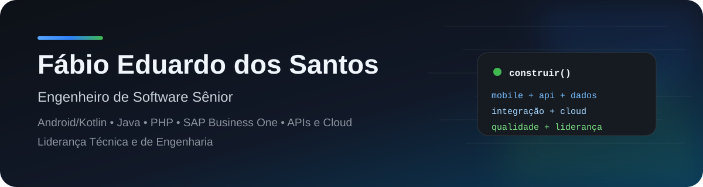

 

**Engenheiro de Software Sênior | Android/Kotlin • Java • PHP • SAP Business One • APIs e Cloud • Liderança Técnica e de Engenharia**

[Site profissional](https://fbsantos.com.br) · [LinkedIn](https://www.linkedin.com/in/fabioedusantos/) · [Repositórios](https://github.com/fabioedusantos?tab=repositories)

---

## 👋 Sobre mim

Sou engenheiro de software com **mais de 15 anos de experiência**, atuando na construção de aplicações, APIs, integrações e plataformas corporativas. Minha trajetória combina desenvolvimento **hands-on** com arquitetura, qualidade, infraestrutura e liderança de equipes.

Gosto especialmente de problemas que atravessam várias camadas do produto: do aplicativo à API, do banco de dados à integração com ERP, do ambiente de execução ao processo de engenharia.

Minha atuação passa principalmente por:

- 📱 **Android nativo**, com Kotlin e Java;
- ⚙️ **Backend e APIs**, com PHP, SlimPHP e integrações REST;
- 🔗 **SAP Business One**, integrações e soluções conectadas ao ERP;
- ☁️ **Cloud e infraestrutura**, com Docker, Linux e Google Cloud;
- 🧭 **Liderança técnica e de engenharia**, qualidade, processos e desenvolvimento de pessoas.

Também atuei como professor no ensino superior e técnico. Parte dos materiais utilizados em aula está preservada neste GitHub como acervo de estudo e registro da evolução dos projetos.

---

## 🚀 Projetos que representam meu trabalho

| Projeto | O que ele demonstra |
| --- | --- |
| **[Kotlin-SlimPHP-FullStack-Starter](https://github.com/fabioedusantos/Kotlin-SlimPHP-FullStack-Starter)** | Base full stack com **Android/Kotlin + Jetpack Compose** e backend **PHP/SlimPHP 4**, reunindo autenticação, JWT, MariaDB, Redis, Docker, Firebase e OpenAPI em um monorepo. |
| **[Select2-jQuery-Extensions](https://github.com/fabioedusantos/Select2-jQuery-Extensions)** | Extensões reutilizáveis para Select2/jQuery, com pesquisa Ajax, selects locais e ajustes visuais. Nasceu de necessidades reais em sistemas web e integrações corporativas. |
| **[SimpleHttpClient](https://github.com/fabioedusantos/SimpleHttpClient)** | Cliente HTTP simples em Java para `GET`, `POST`, `PUT` e `DELETE` usando `HttpURLConnection`, criado para reaproveitamento em projetos Java e Android. |
| **[AppPresentes](https://github.com/fabioedusantos/AppPresentes)** | Monorepo Android + Web Service REST, com CRUD, autenticação, persistência e comunicação cliente/servidor. |
| **[Android-Study-Fundamentals-2017](https://github.com/fabioedusantos/Android-Study-Fundamentals-2017)** | Série consolidada de aulas cobrindo UI, Activities, Intent/Bundle, adapters, SQLite, DAO e relacionamentos. |
| **[Android-Study-Basics](https://github.com/fabioedusantos/Android-Study-Basics)** | Coleção de aulas introdutórias de Android com exemplos independentes e objetivos didáticos bem definidos. |

> **Sugestão para os pins do perfil:** fixe os seis repositórios acima. Eles mostram variedade técnica sem misturar demais a vitrine principal com o acervo completo.

---

## 🧩 Minha caixa de ferramentas

**Linguagens**  
`Kotlin` · `Java` · `PHP` · `JavaScript` · `SQL`

**Android**  
`Jetpack Compose` · `Material 3` · `Room` · `Retrofit/OkHttp` · `Firebase` · `SQLite`

**Backend e APIs**  
`SlimPHP` · `REST` · `JWT` · `OpenAPI` · `Redis` · `CodeIgniter` · `Laravel`

**Dados**  
`MariaDB` · `MySQL` · `SQLite` · `SQL Server`

**Infraestrutura e entrega**  
`Docker` · `Linux` · `Google Cloud` · `Git` · `automação de deploy` · `backup/restore`

**Integrações corporativas**  
`SAP Business One` · `Service Layer` · `DI API` · `UI API`

**Engenharia**  
`arquitetura` · `qualidade` · `BDD` · `testes` · `Scrum` · `Kanban` · `gestão de projetos` · `liderança técnica`

---

## 🏗️ Como penso software

<table>
<tr>
<td width="50%" valign="top">

### Produto antes da tecnologia
Tecnologia é meio. Procuro entender o problema, as regras de negócio e o impacto da solução antes de escolher ferramentas e abstrações.

</td>
<td width="50%" valign="top">

### Simplicidade com responsabilidade
Prefiro código compreensível, reutilizável e testável a arquiteturas sofisticadas que não entregam valor proporcional à complexidade.

</td>
</tr>
<tr>
<td width="50%" valign="top">

### Integração de ponta a ponta
Tenho interesse especial em soluções que conectam **mobile, backend, dados, ERP e infraestrutura**, sem perder clareza entre as responsabilidades.

</td>
<td width="50%" valign="top">

### Engenharia também é gente
Qualidade de software passa por comunicação, documentação, processos saudáveis, autonomia e desenvolvimento das pessoas do time.

</td>
</tr>
</table>

---

## 🎓 Engenharia, liderança e compartilhamento de conhecimento

Minha carreira não ficou restrita ao código. Também atuei com estruturação de times, processos de desenvolvimento, gestão de projetos e qualidade de software.

Como professor, produzi materiais de **Android, Java, SQLite, DAO, APIs REST e desenvolvimento mobile**. Os repositórios `Android-Study-*` organizam parte desse conteúdo por assunto e período.

<strong>Ver acervo técnico e acadêmico</strong>

 

### Android + persistência
- [Android-Study-SQLite-DAO-2016](https://github.com/fabioedusantos/Android-Study-SQLite-DAO-2016)
- [Android-Study-Eclipse-ADT-SQLite-CRUD-2016](https://github.com/fabioedusantos/Android-Study-Eclipse-ADT-SQLite-CRUD-2016)
- [Android-Study-DAO-SQLite](https://github.com/fabioedusantos/Android-Study-DAO-SQLite)
- [Android-Study-CRUD-SQLite](https://github.com/fabioedusantos/Android-Study-CRUD-SQLite)
- [Android-Study-Pedidos](https://github.com/fabioedusantos/Android-Study-Pedidos)

### Android + comunicação e dados
- [Android-Study-REST-JSON-2016](https://github.com/fabioedusantos/Android-Study-REST-JSON-2016)
- [Android-Study-JSON-Parsing-2016](https://github.com/fabioedusantos/Android-Study-JSON-Parsing-2016)
- [Android-Study-Activity-Intent-Bundle-2016](https://github.com/fabioedusantos/Android-Study-Activity-Intent-Bundle-2016)

### Android + bibliotecas
- [Android-Study-Barcode-QR-Scanner-2016](https://github.com/fabioedusantos/Android-Study-Barcode-QR-Scanner-2016)

### Front-end
- [VueJsMakeYourBurger](https://github.com/fabioedusantos/VueJsMakeYourBurger)

---

## 📈 Atividade no GitHub

O **calendário oficial de contribuições do GitHub**, exibido logo abaixo deste README no perfil, é a referência para minha atividade diária.

Preferi manter esta página **sem gráficos dinâmicos de terceiros**: além de evitar imagens quebradas, isso deixa a apresentação mais rápida, estável e dependente apenas do próprio GitHub.

---

## ✍️ Conteúdo e experiência compartilhada

Além do código, escrevo e compartilho conteúdo sobre:

- engenharia e desenvolvimento de software;
- liderança técnica e gestão de equipes;
- arquitetura e integração de sistemas;
- SAP Business One;
- APIs, cloud e modernização de aplicações.

➡️ **[Acompanhe meus artigos e publicações no LinkedIn](https://www.linkedin.com/in/fabioedusantos/)**

---

## 🤝 Vamos conversar?

Se o assunto envolver **Android/Kotlin, Java, PHP, APIs, SAP Business One, arquitetura, cloud ou liderança de engenharia**, provavelmente teremos uma boa conversa.

**Bauru · São Paulo · Brasil**

[🌐 fbsantos.com.br](https://fbsantos.com.br) · [💼 LinkedIn](https://www.linkedin.com/in/fabioedusantos/) · [💻 GitHub](https://github.com/fabioedusantos)

