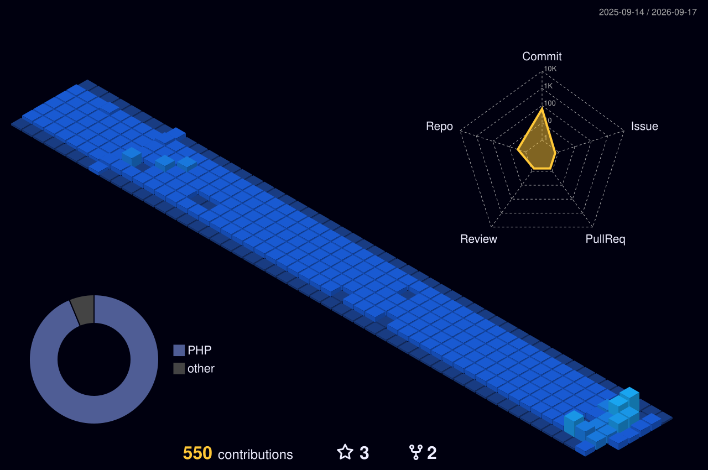

<h1 align="center">Fábio Eduardo dos Santos</h1>

  <strong>Engenheiro de Software Sênior</strong> 
  Android/Kotlin • Java • PHP • SAP Business One • APIs e Cloud • Liderança Técnica e de Engenharia

  <a href="https://fbsantos.com.br"><strong>🌐 Site profissional</strong></a>
  &nbsp;•&nbsp;
  <a href="https://www.linkedin.com/in/fabioedusantos/"><strong>💼 LinkedIn</strong></a>
  &nbsp;•&nbsp;
  <a href="http://lattes.cnpq.br/5862313428296953"><strong>🎓 Lattes</strong></a>
  &nbsp;•&nbsp;
  <a href="https://github.com/fabioedusantos?tab=repositories"><strong>💻 Repositórios</strong></a>

  <strong>Professor desde 2007 • Desenvolvedor de software desde 2009 • Liderança de engenharia desde 2018</strong>

> **Tecnologia, liderança e educação fazem parte da mesma história para mim.** Gosto de transformar problemas reais em soluções robustas, aproximando aplicação, API, dados, infraestrutura, integração e pessoas.

---

## 👋 Muito prazer, sou o Fábio

Minha história com tecnologia começou antes da carreira profissional, mas foi em **2009** que o desenvolvimento de software passou a fazer parte definitivamente da minha vida.

Comecei pela web, especialmente com **PHP**, construindo portais e soluções em uma época em que frameworks ainda não dominavam o desenvolvimento. Com o tempo, minha atuação se ampliou para **Java, Android, integrações corporativas, SAP Business One, APIs, bancos de dados e cloud**.

Não costumo enxergar desenvolvimento apenas pelas divisões de *front-end*, *back-end* ou *full stack*. O que me motiva é compreender o problema e construir a solução necessária — seja ela um aplicativo Android, uma API, uma integração com ERP, um processo de engenharia ou uma arquitetura inteira.

Desde **2018**, também venho exercendo funções de liderança, coordenando equipes multidisciplinares, projetos, qualidade e infraestrutura, sem me afastar completamente do código.

E existe uma parte essencial dessa trajetória que começou ainda antes: **a educação**. Dou aulas desde **2007**, em cursos de qualificação, técnicos e superiores. Ensinar tecnologia ajudou a formar a maneira como trabalho: explicar com clareza, organizar conhecimento, desenvolver pessoas e transformar complexidade em algo compreensível.

---

## 🧭 Minha jornada

| Período | Marco |
| --- | --- |
| **2007** | Início da atuação como professor e instrutor de tecnologia. |
| **2009** | Início da trajetória profissional em desenvolvimento de software, com forte atuação em PHP e aplicações web. |
| **2011** | Conclusão do Bacharelado em Ciência da Computação. |
| **2014** | Especialização em Desenvolvimento de Sistemas para Ambientes Web Baseados em Tecnologia Java. |
| **2017** | Ampliação da atuação para soluções web/mobile integradas ao **SAP Business One**, APIs e infraestrutura em nuvem. |
| **2018** | Início da atuação em **liderança de equipes de desenvolvimento**, gestão de projetos, qualidade e produtos. |
| **2024** | Retorno com forte foco técnico em **Android nativo com Kotlin**, APIs, geolocalização, mapas e operação offline. |

---

## 💼 O que eu levo para um projeto

<table>
<tr>
<td width="50%" valign="top">

### 📱 Desenvolvimento de software
Android nativo com **Kotlin e Java**, aplicações web, APIs, persistência local, integração com serviços e desenvolvimento orientado ao problema de negócio.

</td>
<td width="50%" valign="top">

### 🔗 Integrações corporativas
Experiência com **SAP Business One**, Service Layer, DI API/UI API e integração entre ERP, aplicações web, mobile, APIs e serviços externos.

</td>
</tr>
<tr>
<td width="50%" valign="top">

### ☁️ Cloud e infraestrutura
Atuação com **Google Cloud Platform, Linux, Docker, balanceamento de carga, automação de deploy, backup/restore e alta disponibilidade**.

</td>
<td width="50%" valign="top">

### 🧭 Liderança e engenharia
Gestão de equipes multidisciplinares, projetos, produtos e qualidade, com uso de **Scrum, Kanban, BDD, testes automatizados e indicadores para tomada de decisão**.

</td>
</tr>
</table>

Ao longo dessa trajetória, liderei equipes com **até 22 profissionais**, envolvendo desenvolvimento, análise, qualidade e DevOps. Também participei da criação e estruturação de áreas de qualidade, implantação de BDD e testes automatizados, gestão de ambientes em cloud e condução simultânea de múltiplos projetos.

---

## 🚀 Projetos que representam meu trabalho

<table>
<tr>
<td width="50%" valign="top">

### [Kotlin-SlimPHP-FullStack-Starter](https://github.com/fabioedusantos/Kotlin-SlimPHP-FullStack-Starter)

Uma base que representa bem minha forma de trabalhar: **Android/Kotlin + Jetpack Compose** no cliente e **PHP/SlimPHP 4** no backend, reunidos em um monorepo.

`Kotlin` `Compose` `SlimPHP` `JWT` `MariaDB` `Redis` `Docker` `Firebase`

</td>
<td width="50%" valign="top">

### [Select2-jQuery-Extensions](https://github.com/fabioedusantos/Select2-jQuery-Extensions)

Extensões criadas para resolver necessidades reais de pesquisa e seleção em sistemas web, inclusive em projetos ligados ao **SAP Business One**.

`JavaScript` `jQuery` `Select2` `Ajax` `Bootstrap`

</td>
</tr>
<tr>
<td width="50%" valign="top">

### [SimpleHttpClient](https://github.com/fabioedusantos/SimpleHttpClient)

Cliente HTTP simples e reutilizável em Java, criado para ser levado entre projetos Android e Java sem dependências desnecessárias.

`Java` `HTTP` `Android` `HttpURLConnection`

</td>
<td width="50%" valign="top">

### [AppPresentes](https://github.com/fabioedusantos/AppPresentes)

Aplicativo Android e Web Service REST no mesmo monorepo, demonstrando a integração completa entre cliente, API, autenticação e persistência.

`Android` `Java` `REST` `PHP` `SQLite`

</td>
</tr>
<tr>
<td width="50%" valign="top">

### [Android-Study-Fundamentals-2017](https://github.com/fabioedusantos/Android-Study-Fundamentals-2017)

Série de aulas consolidada em um único repositório, passando de fundamentos de interface até SQLite, DAO e tabelas relacionais.

`Android` `Java` `SQLite` `DAO`

</td>
<td width="50%" valign="top">

### [Android-Study-Basics](https://github.com/fabioedusantos/Android-Study-Basics)

Material introdutório criado em sala de aula para ensinar fundamentos do Android por meio de exemplos pequenos e independentes.

`Android` `Java` `Activities` `Widgets` `ListView`

</td>
</tr>
</table>

---

## 🛠️ Tecnologias que fazem parte da minha trajetória

| Área | Tecnologias |
| --- | --- |
| **Linguagens** | `Kotlin` `Java` `PHP` `JavaScript` `SQL` `C#` `C` |
| **Android** | `Jetpack Compose` `Material` `Room` `Retrofit` `OkHttp` `Firebase` `SQLite` |
| **Backend** | `SlimPHP` `CodeIgniter` `Laravel` `REST` `JWT` `OpenAPI` `Redis` |
| **Front-end** | `Vue.js` `JavaScript` `jQuery` `Bootstrap` |
| **Dados** | `MariaDB` `MySQL` `SQLite` `SQL Server` |
| **SAP Business One** | `Service Layer` `DI API` `UI API` `integrações web/mobile` |
| **Cloud & DevOps** | `Google Cloud` `Docker` `Linux` `Git` `CI/CD` `load balancing` `backup/restore` |
| **Engenharia** | `arquitetura` `BDD` `testes` `Scrum` `Kanban` `gestão de projetos` `liderança` |

---

## 📊 Atividade e contribuições

  

  <picture>
    <source media="(prefers-color-scheme: dark)" srcset="./assets/contribution-snake-dark.svg">
    <source media="(prefers-color-scheme: light)" srcset="./assets/contribution-snake.svg">
    
  </picture>

> Os gráficos são gerados automaticamente pelo GitHub Actions e armazenados neste próprio repositório. O calendário oficial do GitHub continua disponível logo abaixo deste README, com o detalhamento diário das contribuições.

---

## 🧠 Minha forma de trabalhar

<table>
<tr>
<td width="50%" valign="top">

### 🎯 Problema antes da ferramenta
Frameworks mudam. O problema de negócio continua sendo o ponto de partida. Procuro entender o contexto antes de decidir a tecnologia.

</td>
<td width="50%" valign="top">

### 🧩 Código precisa ser compreensível
Gosto de soluções robustas, mas evito complexidade sem propósito. Código deve ser simples de entender, reutilizar, testar e manter.

</td>
</tr>
<tr>
<td width="50%" valign="top">

### 🔄 Visão de ponta a ponta
Não gosto de olhar somente para uma camada. Aplicativo, API, banco, ERP e infraestrutura precisam funcionar como partes coerentes da mesma solução.

</td>
<td width="50%" valign="top">

### 🤝 Liderar é desenvolver pessoas
Processos e ferramentas ajudam, mas equipes fortes são construídas com comunicação, autonomia, responsabilidade, confiança e aprendizado contínuo.

</td>
</tr>
</table>

---

## 🎓 Educação faz parte da minha carreira

Minha atuação como professor começou em **2007** e passou por cursos de qualificação profissional, ensino técnico, graduação e educação a distância.

Ensinei e produzi materiais sobre **lógica de programação, C, Java, Android, PHP, estruturas de dados, persistência, geolocalização, consumo de Web Services e desenvolvimento mobile**.

Acredito que compartilhar conhecimento é uma das melhores formas de consolidá-lo. Muitos dos repositórios `Android-Study-*` deste perfil nasceram justamente das aulas e dos exemplos construídos junto aos alunos.

<strong>📚 Ver acervo acadêmico e técnico</strong>

 

### Android + persistência
- [Android-Study-SQLite-DAO-2016](https://github.com/fabioedusantos/Android-Study-SQLite-DAO-2016)
- [Android-Study-Eclipse-ADT-SQLite-CRUD-2016](https://github.com/fabioedusantos/Android-Study-Eclipse-ADT-SQLite-CRUD-2016)
- [Android-Study-DAO-SQLite](https://github.com/fabioedusantos/Android-Study-DAO-SQLite)
- [Android-Study-CRUD-SQLite](https://github.com/fabioedusantos/Android-Study-CRUD-SQLite)
- [Android-Study-Pedidos](https://github.com/fabioedusantos/Android-Study-Pedidos)

### Android + comunicação e dados
- [Android-Study-REST-JSON-2016](https://github.com/fabioedusantos/Android-Study-REST-JSON-2016)
- [Android-Study-JSON-Parsing-2016](https://github.com/fabioedusantos/Android-Study-JSON-Parsing-2016)
- [Android-Study-Activity-Intent-Bundle-2016](https://github.com/fabioedusantos/Android-Study-Activity-Intent-Bundle-2016)

### Android + bibliotecas
- [Android-Study-Barcode-QR-Scanner-2016](https://github.com/fabioedusantos/Android-Study-Barcode-QR-Scanner-2016)

### Séries consolidadas
- [Android-Study-Fundamentals-2017](https://github.com/fabioedusantos/Android-Study-Fundamentals-2017)
- [Android-Study-Basics](https://github.com/fabioedusantos/Android-Study-Basics)

### Front-end
- [VueJsMakeYourBurger](https://github.com/fabioedusantos/VueJsMakeYourBurger)

---

## ✍️ Desenvolvimento, gestão e conteúdo

Gosto de escrever e conversar sobre temas que fazem parte da minha experiência prática: **desenvolvimento de software, arquitetura, liderança, gestão de projetos, qualidade, SAP Business One, cloud e integração de sistemas**.

➡️ **[Artigos e publicações no LinkedIn](https://www.linkedin.com/in/fabioedusantos/)**  
➡️ **[Conheça minha trajetória completa em fbsantos.com.br](https://fbsantos.com.br)**

---

## 🎹 Além do código

Sou de **Bauru, interior de São Paulo**, e acredito que carreira e vida precisam caminhar juntas.

Além da tecnologia, a música também faz parte de quem sou. Sou **tecladista**, e encontro nela um espaço de criatividade, equilíbrio e conexão que complementa muito bem a lógica e a intensidade do dia a dia em tecnologia.

---

## 🤝 Vamos conversar?

Se o desafio envolver **software, Android/Kotlin, Java, PHP, SAP Business One, APIs, cloud, arquitetura ou liderança de engenharia**, será um prazer trocar ideias.

  <strong>Bauru · São Paulo · Brasil</strong>  
  <a href="https://fbsantos.com.br">🌐 fbsantos.com.br</a>
  &nbsp;•&nbsp;
  <a href="https://www.linkedin.com/in/fabioedusantos/">💼 LinkedIn</a>
  &nbsp;•&nbsp;
  <a href="http://lattes.cnpq.br/5862313428296953">🎓 Lattes</a>
  &nbsp;•&nbsp;
  <a href="https://github.com/fabioedusantos">💻 GitHub</a>

